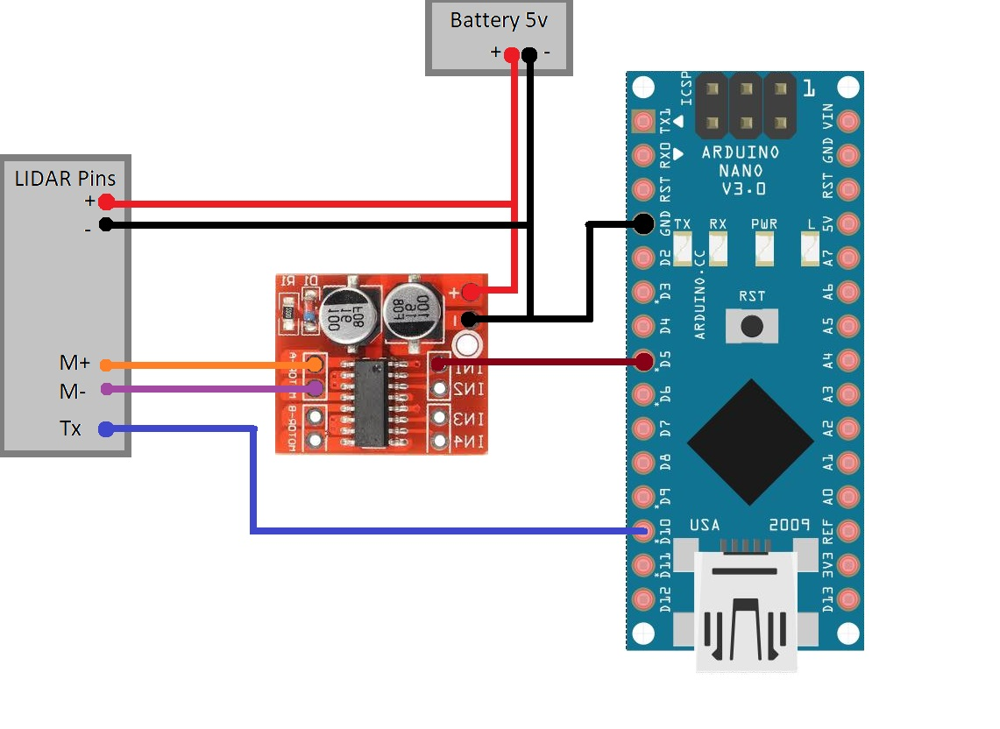
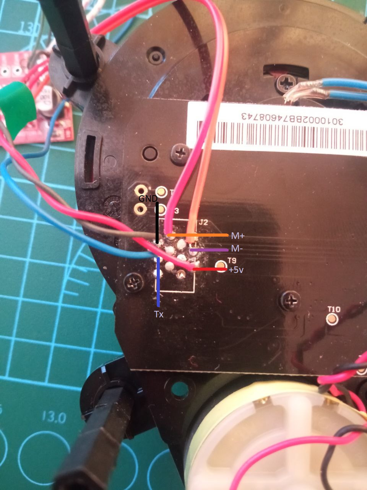
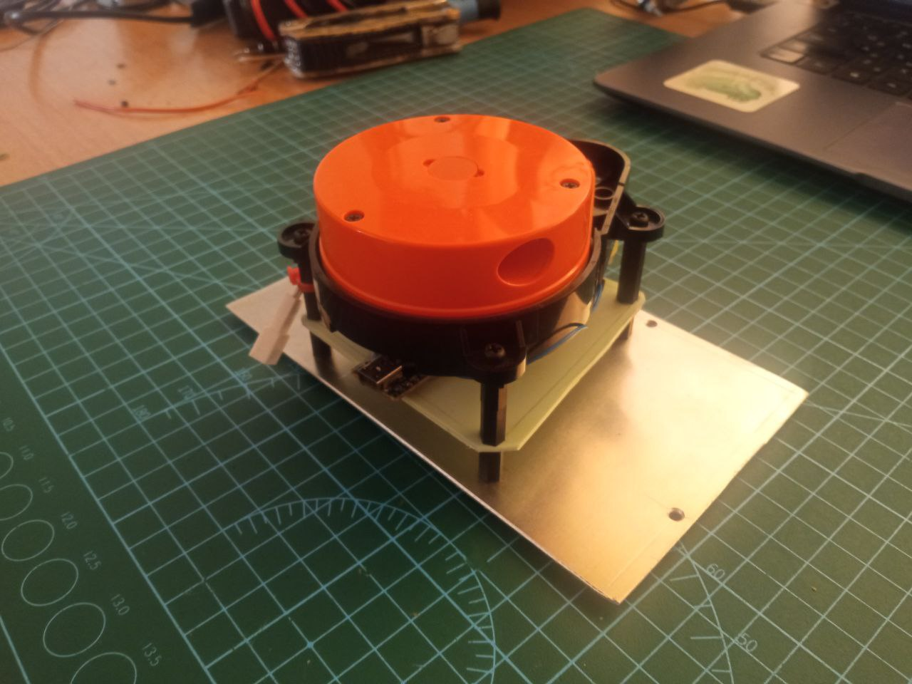

## Python

Python code visualizes lidar data.

Required python libraries:
```console
pip install pyserial
pip install matplotlib
pip install numpy
```

## Components
 - max1508 - motor controller 1x
 - arduino nano - 1x
 - accumulators 5v - 1x
- Laser rangefinder (lidar, distance sensor) for robot vacuum cleaner Roborock Sweep One S50 - 1x

## Scheme:



## Lidar pinout:



## Lidar view

