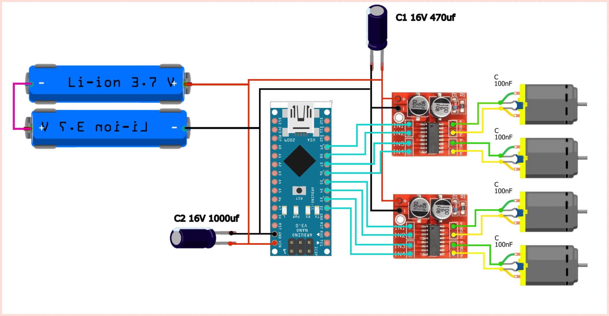

## Components
 - max1508 - motor controller 2x
 - arduino nano - 1x
 - [motors](https://www.ozon.ru/product/motor-so-stalnym-reduktorom-1-90-dlya-arduino-robota-2-vyhodnyh-vala-2-shtuki-1564246234/) - motor with steel gearbox 1:90 for Arduino 4x
 - ceramic capacitor - 100 nF 4x
 - electrolytic capacitor - 16v 470 uF 1x
 - electrolytic capacitor - 16v 1000 uF 1x
 - Li-ion accumulators 18650 - 2x
## Scheme

