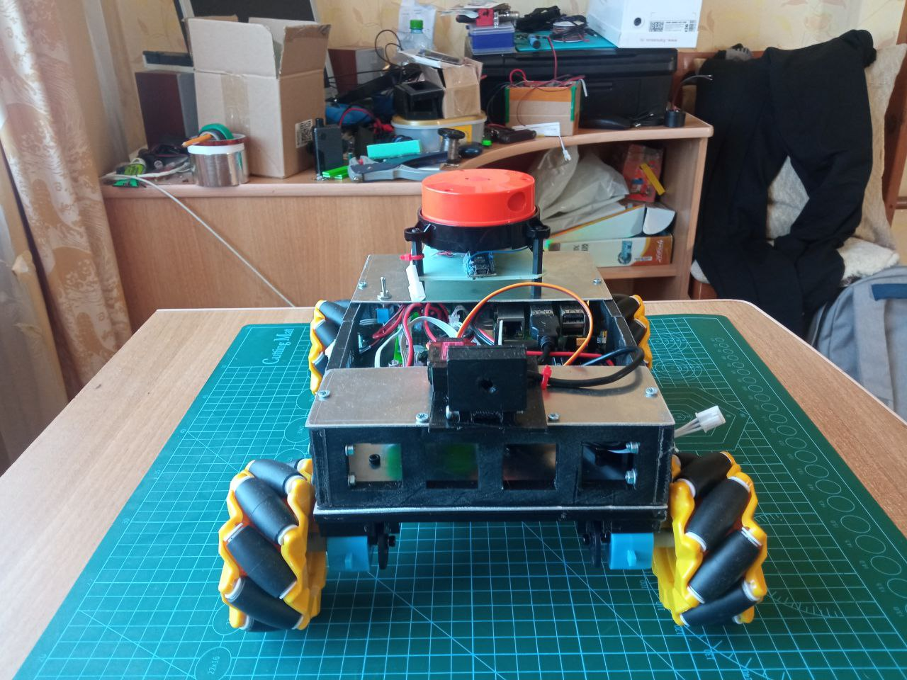
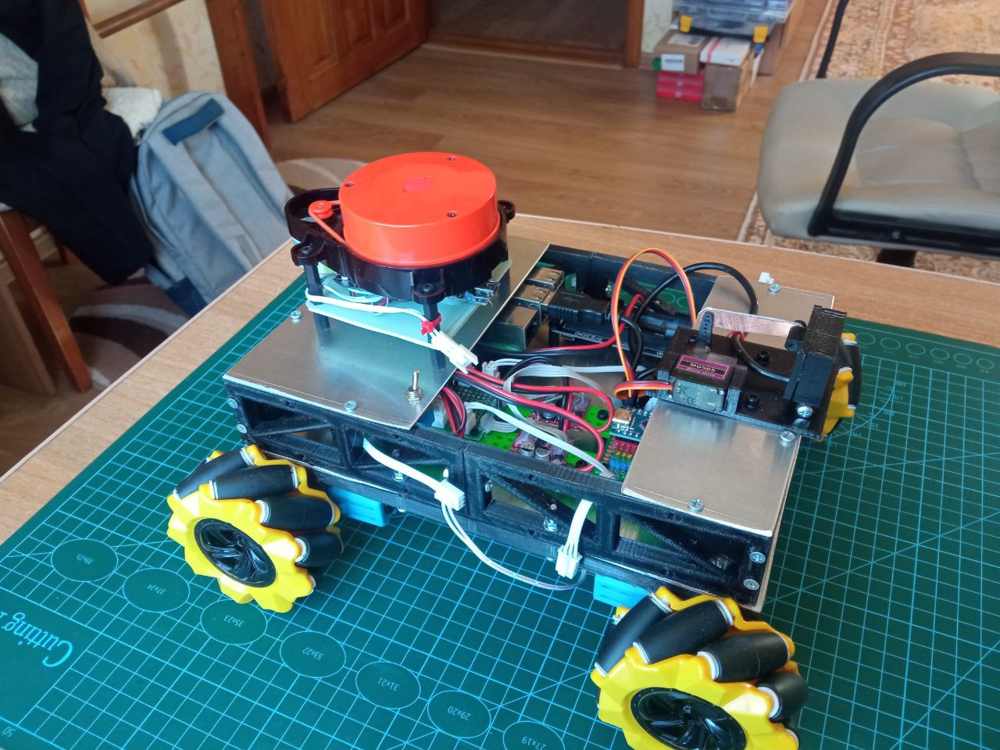
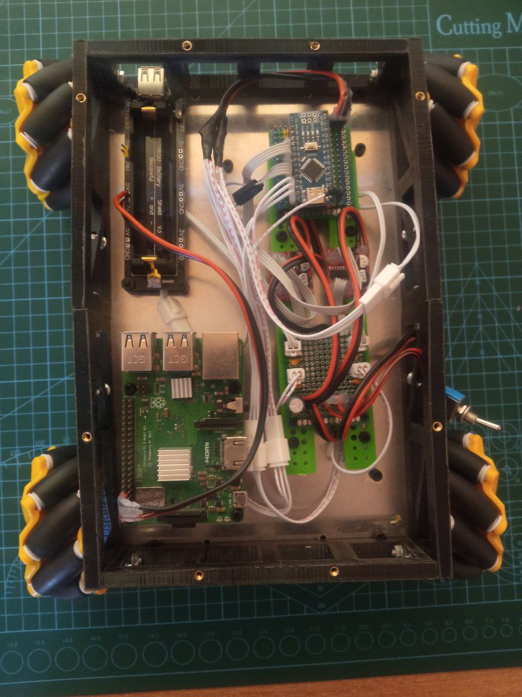
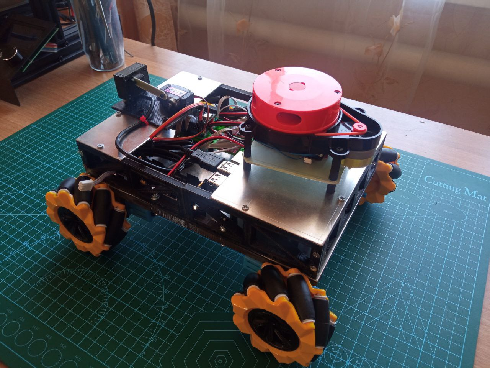

# Driving bobot

## Overview

The robot is designed to test navigation algorithms.

|                                      |  |                                        |
| ------------------------------------ | ------------------------------------- | -------------------------------------- |
|  |       |  |
|                                      |   |                                        |

## Different parts
- [Code for lidar](LIDAR/Lidar.md)
- [Code for PS4 gamepad](PS4_controller/PS4.md)
- [Code for motors controller](Motors_controller/Motors_controller.md)
- [ROS2 source code](telega_ws/ROS2.md)
